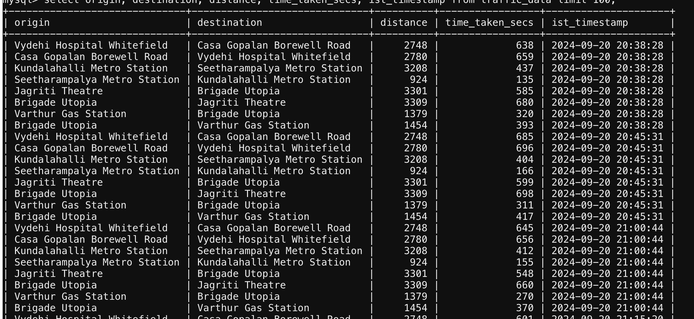
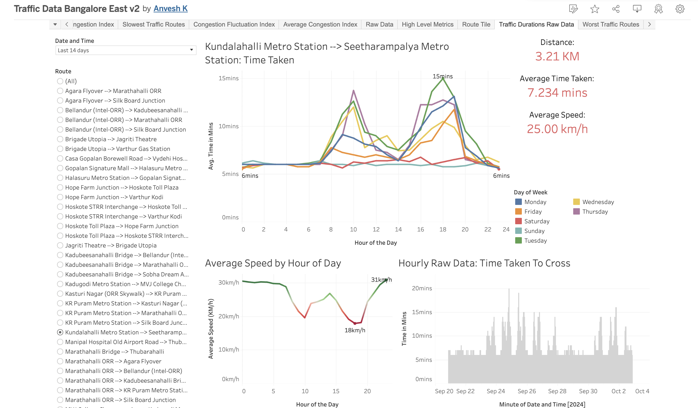

* Manually picked origin and destination pairs and their latlongs (OLA API is bad with places)
* Used OLA API to get time taken to cover the distance 
* Job is hosted on pythonanywhere.com and runs every 15 mints
* Results are stored as logs and also pushed to a mysql on pythonanywhere
* The SQL table is downloaded and served as data source to a Tableau Public visualization (because mysql database connection not allowed on tableau public)

